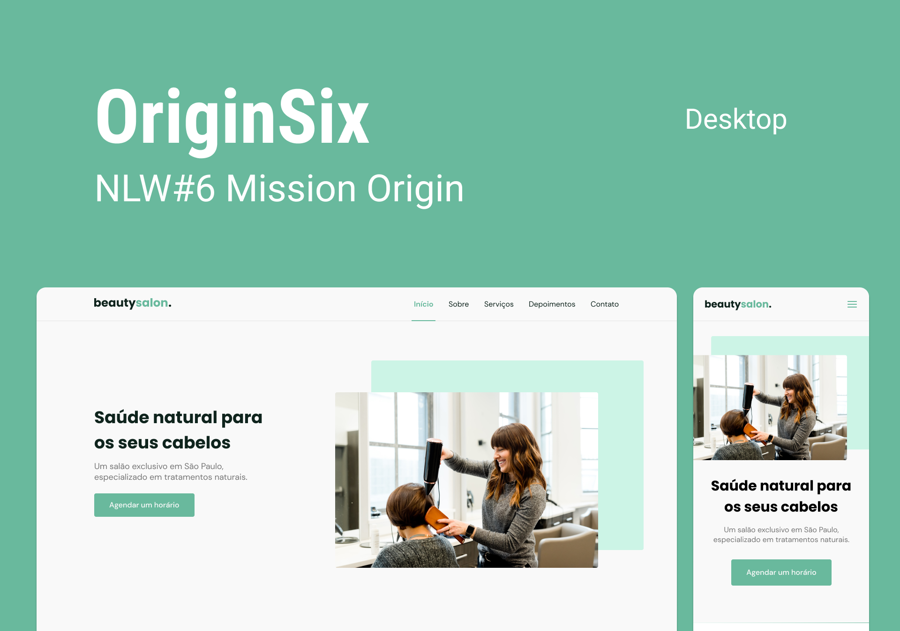

<h1 align="center">
    
</h1>

 

  

## 🚀 Tecnologias

Esse projeto foi desenvolvido com as seguintes tecnologias:

- [HTML](https://developer.mozilla.org/pt-BR/docs/Web/HTML)
- [CSS](https://developer.mozilla.org/pt-BR/docs/Web/CSS)
- [JavaScript](https://developer.mozilla.org/pt-BR/docs/Web/JavaScript)

## 💻 Projeto

O beautysalon e uma página de uma microempresa de salão com agendamentos, depoimentos contato e serviços.

## 🔖 Layout

Nos links abaixo você encontra o layout do projeto web e também do mobile. Lembrando que você precisa ter uma conta no [Figma](http://figma.com/) para acessá-lo.

- [Layout Web / Mobile](https://www.figma.com/file/egItdkNXLBNaHvUJP6V1o1/Origin-Six?node-id=0%3A1)

---

Feito com ♥ by Rocketseat :wave: [Participe da comunidade!](https://discordapp.com/invite/gCRAFhc)
